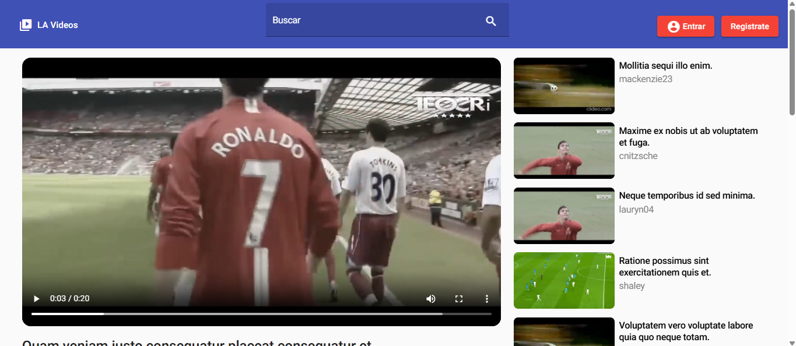

# Lumen Angular Videos (Frontend)

Plataforma de videos basada en youtube, frontend desarrollado con [Angular](https://angular.io/).

- [Convencional commits](https://www.conventionalcommits.org/en/v1.0.0/).
- [Prettier](https://prettier.io/).
- [Angular Material](https://material.angular.io/).

#### Repositorio del backend:
[https://github.com/andres0615/lumen-angular-videos](https://github.com/andres0615/lumen-angular-videos)

### Capturas de pantalla

#### Reproducir video

